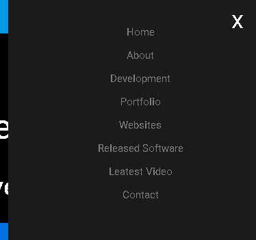
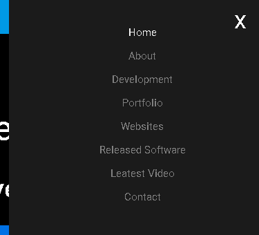
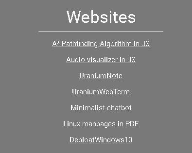

# portfolio-style-css
My custom made style.css file used in my portfolio 

## Style source

raw file link [style.css](https://raw.githubusercontent.com/BeanGreen247/portfolio-style-css/master/style.css)

## Style usage
## Sidebar navigation Menu button


```html
<div class="menubuttonstyle">
        <a id="menu-toggle" onclick="openNav()" class="menu-toggle">&#9776;</a>
</div>  
```

### Sidebar navigation example from my website





```html
<div id="mySidenav" class="sidenav">
        <div class="menuclosebuttonstyle">
        <a href="#top" class="closebtn">x</a>
        </div>
        <a href="#topNav">Home</a>
        <a href="#about">About</a>
        <a href="#development">Development</a>
        <a href="#portfolio">Portfolio</a>
        <a href="#websites">Websites</a>
        <a href="#software">Released Software</a>
        <a href="#ytvid">Leatest Video</a>
        <a href="#contacts">Contact</a>
      </div>
```

### Topbar navigation example from my website


```html
<div id='topNav' class='navbar'>
    <a title='Home' href='index.html'>Home</i></a>
    <a title='Email me!' href='mailto:mozdrent@gmail.com?Subject=Hi%20Thomas'>Email me!</a>
    <a title='Documents' href='pages/documents.html'>Documents</a>
    <a title='Wallpapers' href='pages/wallpaper.html'>Wallpapers</a>
    <a title='Main channel' target='_blank'href='https://www.youtube.com/channel/UCQbA5Nc4oq6uMS2idDWsxkw'>Main YT channel</a>
    <a title='Music channel' target='_blank'href='https://www.youtube.com/channel/UC_Qo-mebrSPXU7EpkyJfJ0g'>Music YT channel</a>
    </div>
```
### Header text example from my website


```html
<div class="headername">
        <h1><b>Tomas Mozdren</b></h1>
        <h2>Hobbyist Software Developer</h2>
</div>
```

### Main text example from my website


```html
<div id="about"; class="maintext">
        <h2 style="font-size: 35px;margin-bottom: 0px;"><b>TL;DR</b></h1>
        <hr class="small">
        <p>
            I am a somewhat capable developer with experience in programming everything from Web development to App
            development creating web apps and desktop applications. If you need something, just let me know and I will
            see what I can do. My background should give you an idea of what I am capable of.
        </p>
    </div>
```

### Main text with pictures example from my website


```html
<div id="portfolio" class="maintext">
    <h2 style="font-size: 35px;margin-bottom: 0px;">My Projects/ Work</h2>
    <hr class="small">
    <h4>
        <strong>UraniumNote</strong>
    </h4>
    <div class="imageshome">
        <a target="_blank" href="https://github.com/BeanGreen247/UraniumNote"></img></a>
    </div>
    <p>JavaScript based note taking app</p>
    <h4>
        <strong>UraniumWebTerm</strong>
    </h4>
    <div class="imageshome">
        <a target="_blank" href="https://github.com/BeanGreen247/UraniumWebTerm"></img></a>
    </div>
    <p>JavaScript based terminal emulator</p>
    <h4>
        <strong>Minimalist chatbot</strong>
    </h4>
    <div class="imageshome">
        <a target="_blank" href="https://github.com/BeanGreen247/Minimalist-chatbot"></img></a>
    </div>
    <p>JavaScript based chatbot</p>
    <h4>
        <strong>Python AI Arts</strong>
    </h4>
    <div class="imageshome">
        <a target="_blank" href="https://github.com/BeanGreen247/Python-AI-Arts"></img></a>
    </div>
    <p>AI for image manipulation written in Python</p>
    </div>
```
### Secondary text example from my website


```html
<div id="development"; class="secondarytext">
        <h2 style="font-size: 35px;margin-bottom: 0px;"><b>Development</b></h2>
        <hr class="small">
    <h4>
        <strong>Desktop</strong>
    </h4>
    <p>C# Desktop Application Development</p>
    <h4>
        <strong>Web</strong>
    </h4>
    <p>From static sites to Web Applications</p>
    <h4>
        <strong>Team Dev</strong>
    </h4>
    <p>Prefer working on apps in a team</p>
    <h4>
        <strong>Open source</strong>
    </h4>
    <p>I love working on open source apps</p>
    </div>
```


### Secondary text  with links example from my website



```html
<div id="websites" class="secondarytext">
    <h2 style="font-size: 35px;margin-bottom: 0px;">Websites</h2>
    <hr class="small">
        <div class="hyperlinks">
            <p><a target="_blank" href="https://beangreen247.github.io/astar-pathfinding-in-js/">A* Pathfinding Algorithm in JS</a></p>
            <p><a target="_blank" href="https://beangreen247.github.io/audio-visualizer-in-js/">Audio visualizer in JS</a></p>
            <p><a target="_blank" href="https://beangreen247.github.io/UraniumNote/">UraniumNote</a></p>
            <p><a target="_blank" href="https://beangreen247.github.io/UraniumWebTerm">UraniumWebTerm</a></p>
            <p><a target="_blank" href="https://beangreen247.github.io/Minimalist-chatbot">Minimalist-chatbot</a></p>
            <p><a target="_blank" href="https://beangreen247.github.io/Linux-Man-Pages-In-PDF/">Linux manpages in PDF</a></p>
            <p><a target="_blank" href="https://beangreen247.github.io/DebloatWindows10/">DebloatWindows10</a></p>
        </div>
    </div>
```

### Footer example from my website

> NOTE
> I used the maintext style class for styling so the only thing affected here are the links themselves


```html
<div id="contacts" class="maintext">
<footer>
    <h2><strong>Thomas Mozdren Software Development</strong></h2>
                    <ul class="list-unstyled">
                        <li>Email:  <a href="mailto:mozdrent@gmail.com">mozdrent@gmail.com</a></li>
                    </ul>
                    <ul class="botbar">
                        <li>
                            <a title="My Linkedin" target="_blank" href="https://www.linkedin.com/in/tom%C3%A1%C5%A1-mozd%C5%99e%C5%88-3382b71a6/">Linkedin</a>
                        </li>
                        <li>
                            <a title="My Twitter" target="_blank" href="https://twitter.com/beangreen247">Twitter</a>
                        </li>
                        <li>
                            <a title="Main channel" target="_blank" href="https://www.youtube.com/channel/UCQbA5Nc4oq6uMS2idDWsxkw">Main YT channel</a>
                        </li>
                        <li>
                            <a title="Music channel" target="_blank" href="https://www.youtube.com/channel/UC_Qo-mebrSPXU7EpkyJfJ0g">Music YT channel</a>
                        </li>
                        <li>
                            <a title="My GitHub" target="_blank" href="https://github.com/BeanGreen247">GitHub</a>
                        </li>
                        <li>
                            <a title="My Slack" target="_blank" href="https://join.slack.com/t/tomasmozdren/shared_invite/enQtNzAxNTY1Nzg1MDEwLTVhMmQ4YTU5ZGMyZTFlMzc3NTQ0ZTMxMGUzYTYzMzlmZTZmNmU3ZDk5NzdiYzc3MDNiNDZlMGRlZjUwMTdlMDk">Slack</a>
                        </li>
                        <li>
                            <a title="My Instagram" target="_blank" href="https://www.instagram.com/beangreen247/">Instagram</a>
                        </li>
                    </ul>
                    <hr class="small">
                    <p class="text-muted">Copyright ©  beangreen247.github.io 2020</p>
                    <a href="pages/privacy.html">Privacy Policy</a>
        </footer>
    </div>
```